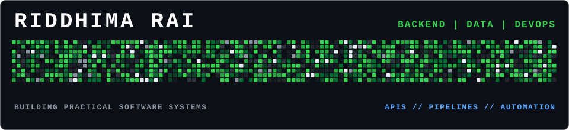
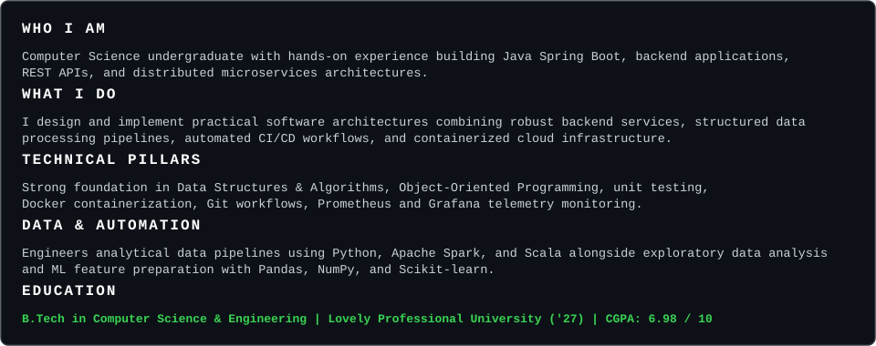
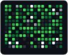
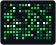
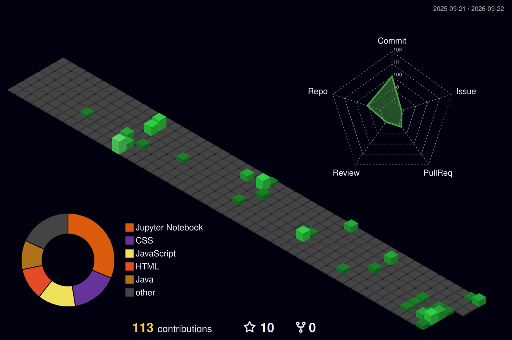
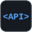

  

  

<table border="0" cellspacing="0" cellpadding="0">
  <tr>
    <td width="130" align="center" valign="middle">
      
    </td>
    <td align="center" valign="middle">
      <table border="0" cellspacing="0" cellpadding="8">
        <tr>
          <th align="center">LinkedIn</th>
          <th align="center">GitHub</th>
          <th align="center">X (Twitter)</th>
          <th align="center">Email</th>
        </tr>
        <tr>
          <td align="center">   </td>
          <td align="center">   </td>
          <td align="center">   </td>
          <td align="center">   </td>
        </tr>
      </table>
    </td>
    <td width="130" align="center" valign="middle">
      
    </td>
  </tr>
</table>

 

  

  

  

 

  

  <table width="100%">
    <!-- ROW 1: Programming & Core Computer Science -->
    <tr>
      <td align="center" width="12.5%"> Java</td>
      <td align="center" width="12.5%"> Python</td>
      <td align="center" width="12.5%"> C++</td>
      <td align="center" width="12.5%"> C</td>
      <td align="center" width="12.5%"> SQL</td>
      <td align="center" width="12.5%"> DSA</td>
      <td align="center" width="12.5%"> OOP</td>
      <td align="center" width="12.5%"> Logic</td>
    </tr>
    <!-- ROW 2: Backend Architecture & APIs -->
    <tr>
      <td align="center"> Spring Boot</td>
      <td align="center"> REST APIs</td>
      <td align="center"> Microservices</td>
      <td align="center"> Django</td>
      <td align="center"> FastAPI</td>
      <td align="center"> Maven</td>
      <td align="center"> JUnit</td>
      <td align="center"> PostgreSQL</td>
    </tr>
    <!-- ROW 3: Data Engineering & Analytics -->
    <tr>
      <td align="center"> Spark</td>
      <td align="center"> Scala</td>
      <td align="center"> Pandas</td>
      <td align="center"> NumPy</td>
      <td align="center"> Scikit-learn</td>
      <td align="center"> ETL</td>
      <td align="center"> EDA</td>
      <td align="center"> HTML5</td>
    </tr>
    <!-- ROW 4: Cloud, DevOps & Monitoring -->
    <tr>
      <td align="center"> AWS EC2</td>
      <td align="center"> Docker</td>
      <td align="center"> Compose</td>
      <td align="center"> Git</td>
      <td align="center"> Actions</td>
      <td align="center"> Prometheus</td>
      <td align="center"> Grafana</td>
      <td align="center"> Puppet</td>
    </tr>
    <!-- ROW 5: Additional Monitoring & Web -->
    <tr>
      <td align="center"> Nagios Core</td>
      <td align="center"> CSS3</td>
      <td align="center" colspan="6"></td>
    </tr>
  </table>

 

  

<!-- PROJECT 1 CARD -->
<table width="100%" border="0" cellpadding="12">
  <tr>
    <td bgcolor="#0d1117">
      <table width="100%" border="0">
        <tr>
          <td>
            <strong>CYBERSECURITY THREAT INTELLIGENCE PLATFORM</strong> 
            Status: August 2026 – Present 
          </td>
          <td align="right" valign="top">
            
          </td>
        </tr>
      </table>
      

      STACK: Python | FastAPI | REST APIs | Apache Spark | Scala | Docker | GitHub Actions | NVD/CVE API | Scikit-learn | Parquet
        
      <ul>
        <li>Engineered an end-to-end vulnerability intelligence pipeline that ingests and normalizes official NVD/CVE security data through paginated API requests using Python and FastAPI.</li>
        <li>Engineered Apache Spark pipelines using Scala to transform vulnerability records into structured Parquet datasets and ML-ready features for risk scoring, clustering, and anomaly detection.</li>
        <li>Built REST API endpoints for vulnerability analytics and automated container build and deployment workflows using Docker and GitHub Actions.</li>
      </ul>
    </td>
  </tr>
</table>

 

<!-- PROJECT 2 CARD -->
<table width="100%" border="0" cellpadding="12">
  <tr>
    <td bgcolor="#0d1117">
      <table width="100%" border="0">
        <tr>
          <td>
            <strong>ORION: MULTI-SERVICE BACKEND &amp; CI/CD PLATFORM</strong> 
            Status: May 2026 – June 2026 
          </td>
          <td align="right" valign="top">
            
          </td>
        </tr>
      </table>
      

      STACK: Java 17 | Spring Boot 3.2 | REST APIs | JPA | PostgreSQL | JUnit 5 | Maven | Docker | Docker Compose | GitHub Actions | Prometheus | Grafana
        
      <ul>
        <li>Developed a Java Spring Boot analytics microservice using REST APIs and JPA, backed by PostgreSQL, as part of a polyglot microservices architecture.</li>
        <li>Implemented JUnit 5 unit testing and a 7-stage GitHub Actions CI/CD pipeline covering build, test, Docker image creation, and integration verification.</li>
        <li>Containerized the multi-service stack using Docker Compose with health-check-based service dependencies and integrated Prometheus and Grafana for real-time application and JVM monitoring.</li>
      </ul>
    </td>
  </tr>
</table>

 

<!-- PROJECT 3 CARD -->
<table width="100%" border="0" cellpadding="12">
  <tr>
    <td bgcolor="#0d1117">
      <table width="100%" border="0">
        <tr>
          <td>
            <strong>DYNAMIC LOAD BALANCER FOR MULTI-CORE SYSTEMS</strong> 
            Status: January 2025 – February 2025 
          </td>
          <td align="right" valign="top">
            
          </td>
        </tr>
      </table>
      

      STACK: Python | PyQt6 | NumPy | Matplotlib
        
      <ul>
        <li>Developed a real-time load balancing simulator supporting dynamic workload visualization across 2 to 8 virtual processors.</li>
        <li>Designed adaptive task scheduling and migration algorithms to optimize workload distribution across processors.</li>
        <li>Implemented live monitoring of CPU utilization, queue states, and task migration trends.</li>
      </ul>
    </td>
  </tr>
</table>

 

  

<table width="100%" border="0" cellpadding="12">
  <tr>
    <td bgcolor="#0d1117">
      <strong>PROJECT MANAGEMENT INTERN</strong> 
      Helioustin Pvt. Ltd. | June 2026 – August 2026
      

      <ul>
        <li>Conducted structured research and competitive analysis across 14+ industries and 150+ target organizations.</li>
        <li>Evaluated cybersecurity maturity, compliance requirements, and market opportunities.</li>
        <li>Synthesized market intelligence and industry findings into executive reports supporting business development, client acquisition, and strategic decision-making.</li>
      </ul>
    </td>
  </tr>
</table>

 

  

<table width="100%" border="0" cellpadding="10">
  <tr>
    <td width="50%" bgcolor="#0d1117" valign="top">
      CREDENTIAL // 01 
      <strong>Oracle Cloud Infrastructure 2025 Certified Data Science Professional</strong> 
      Issuer: Oracle
    </td>
    <td width="50%" bgcolor="#0d1117" valign="top">
      CREDENTIAL // 02 
      <strong>Python Full Stack &amp; Cloud Computing</strong> 
      Issuer: Coding Spoon
    </td>
  </tr>
  <tr>
    <td width="50%" bgcolor="#0d1117" valign="top">
      CREDENTIAL // 03 
      <strong>Java Programming</strong> 
      Issuer: Lovely Professional University / iamneo
    </td>
    <td width="50%" bgcolor="#0d1117" valign="top">
      CREDENTIAL // 04 
      <strong>Object Oriented Programming</strong> 
      Issuer: Lovely Professional University / iamneo
    </td>
  </tr>
</table>

 

  

<table width="100%" border="0" cellpadding="10">
  <tr>
    <td width="33.3%" bgcolor="#0d1117" valign="top">
      OPEN SOURCE 
      <strong>GSSoC 2025</strong> 
      Tech Contributor
    </td>
    <td width="33.3%" bgcolor="#0d1117" valign="top">
      CODING BADGES 
      <strong>HackerRank</strong> 
      2-Star Java | 2-Star Python | 3-Star SQL
    </td>
    <td width="33.3%" bgcolor="#0d1117" valign="top">
      HACKATHON 
      <strong>Cognizant Technoverse 2026</strong> 
      Certificate of Appreciation for Participation
    </td>
  </tr>
</table>

 

  SYSTEM ARCHITECTURE // BACKEND // DATA PIPELINES // DEVOPS

